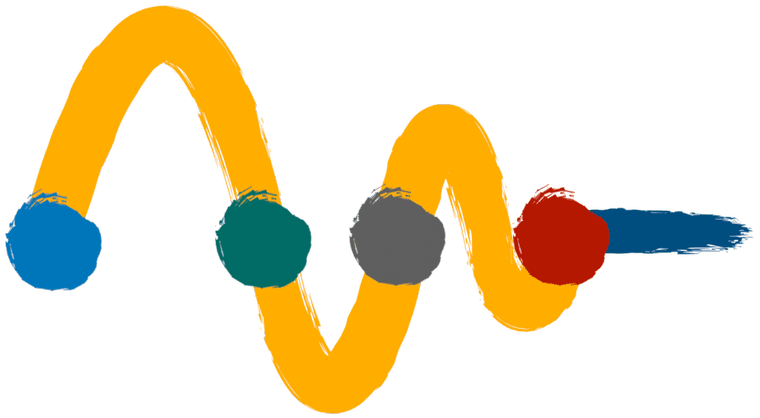

      

# AMIQS :otter:

 

##### *`Averaging Method to Integrate Quantum Systems`*  *by [Pilar Hernández](https://inspirehep.net/authors/1006155?ui-citation-summary=true), [Jacobo López-Pávon](https://inspirehep.net/authors/1050355?ui-citation-summary=true), [Nuria Rius](https://inspirehep.net/authors/991635?ui-citation-summary=true) and [Stefan Sandner](https://inspirehep.net/authors/1741540?ui-citation-summary=true)*

Calculates the baryon asymmetry generated via quantum oscillations of right handed neutrinos in the early Universe. A Nested Sampling algorithm for an efficient parameter space scan including the light neutrino data constraints is implemented.

## Instalation

See the respective folder for the requirements to compile and run the code.

## Documentation

Take a look at the [AMIQS documentation](https://stefanmarinus-rtd.readthedocs.io/en/latest/) to learn about the code in full detail.

## Citation

If you use the code, please link this repository, and cite [arXiv:2201.xxxxx](http://arxiv.org/abs/2201.xxxxx) and the DOI [10.xxxx/zenodo.xxxxx](https://doi.org/10.xxx/zenodo.xxxxx).

## Contact
For any type of comments, questions etc. feel free to contact us at <stefan.sandner@ific.uv.es> :otter:.

